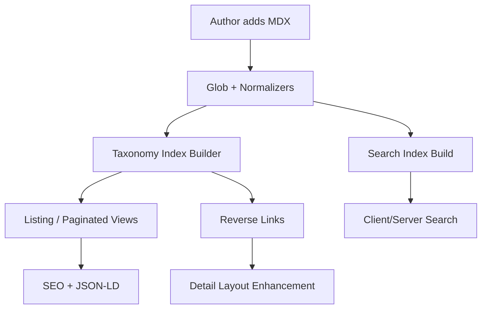

```
   ___  ____ _____ ____   ___        _                    _                 _            
  / _ \/ ___|_   _|  _ \ / _ \ _   _| |_ _ __ _   _    __| | ___  _ __   __| | ___  _ __ 
 | | | \___ \ | | | | | | | | | | | | __| '__| | | |  / _` |/ _ \| '_ \ / _` |/ _ \| '__|
 | |_| |___) || | | |_| | |_| | |_| | |_| |  | |_| | | (_| | (_) | | | | (_| | (_) | |   
  \___/|____/ |_| |____/ \__\_\\__,_|\__|_|   \__, |  \__,_|\___/|_| |_|\__,_|\___/|_|   
                                              |___/                                      
```

# Premier Upgrade Plan – Astro Dark Business Theme (Reusable Template Evolution)

> Status: DRAFT (awaiting approval)  
> Scope: Remaining feature set to elevate the theme from “adapted fork” to a polished, reusable, extensible Astro business template.

## 1. Objectives

1. Unify content systems (Blog, Solutions, Industries) under a consistent taxonomy & relationship model.
2. Add production-grade enhancements: pagination, filtering, search, structured data, RSS, performance budgets.
3. Provide first-class documentation & developer experience (DX) with automation scripts.
4. Package the theme as a reusable template (internal + optional public distribution) without upstream fork ties.
5. Establish governance: branching strategy, release versioning, CI hooks, quality gates.

## 2. High-Level Architecture (Target)



## 3. Feature Breakdown

| Feature | Description | Priority | Notes |
|---------|-------------|----------|-------|
| Pagination | Page through large listings (Blog, Solutions, Industries) | High | Static route generation with predictable URL pattern `/page/2` |
| Unified Taxonomy | Single tag/category model across all content types | High | Optional distinct scopes (`tagType`) later |
| Reverse Linking | Auto compute solution ↔ industry ↔ blog references | High | Deterministic build-time graph |
| Filtering | Multi-select filters (tags, industries, solutions) | Medium | Query param based (`?tags=a,b&industry=healthcare`) |
| Search | Lightweight static JSON search index + fuzzy client filter | Medium | Avoid large libs; optional Lunr/FlexSearch |
| RSS Feeds | Blog + Solutions (optional) feed | Medium | Atom/RSS standardized |
| JSON-LD | Structured data for Articles, Products (solutions), Industries (custom/Thing) | High | In layout head slots |
| Sitemap Enhancements | Segment priority & changefreq | Low | Config-based weights |
| Performance Budgets | Build script asserts max bundle & image sizes | Medium | Fails CI over threshold |
| Theming Tokens 2.0 | Formal design tokens (colors, spacing, radii, typography) | Medium | JSON source → CSS vars emit |
| CLI Scaffolder | `pnpm exec theme-cli new solution` | Medium | Template MDX generator |
| Config Centralization | `theme.config.(js|mjs)` for toggles (rss, search, etc.) | High | Single source of truth |
| DX Docs Overhaul | Full docs site MD content + diagrams | High | ASCII + Mermaid + usage playbooks |
| Release/Versioning | Conventional commits + CHANGELOG | Medium | Standard semver tagging |
| QA Workflows | Markdown lint, link check, accessibility scan | Medium | GitHub Actions |

## 4. Phased Roadmap

| Phase | Title | Scope | Exit Criteria |
|-------|-------|-------|---------------|
| 0 | Baseline & Inventory | Capture current content & metrics | Snapshot documented |
| 1 | Pagination | Implement for all three listing types | `/blog/page/2` works & tests pass |
| 2 | Taxonomy Core | Unified tag model + migration notes | Tags render across sections |
| 3 | Relationship Graph | Auto reverse links + relation blocks | Cross-link blocks visible |
| 4 | Filters & Search | Query filters + local search index | Combined filters functional |
| 5 | SEO & Structured | JSON-LD, enhanced meta, RSS, sitemap weights | Validation via Lighthouse & Rich Results |
| 6 | Theming & Tokens | Token source + CSS generation pipeline | Tokens compiled & docs updated |
| 7 | Docs & DX | New docs suite + CLI scaffolder | Dev can onboard <15 min |
| 8 | Packaging & Release | Versioning, changelog, distribution strategy | v1.0.0 tag & release notes |
| 9 | Quality Gates | CI checks (lint, accessibility, perf) | All enforced in PRs |
| 10 | Hardening & Polish | Edge case tests, refactors, cleanup | Zero known P1 defects |

## 5. Detailed Specs

### 5.1 Pagination
- Pattern: `/blog/page/2`, `/solutions/page/3`, `/industries/page/2`.
- Page size configurable: `theme.config.js` (default 10).
- Implementation: Build-time chunking -> dynamic collection arrays.

### 5.2 Unified Taxonomy Model
Data shape (TypeScript style):
```ts
type TaxonomyEntry = {
  slug: string;
  label: string;
  type: 'tag'; // future: category, segment
  contentRefs: string[]; // URLs referencing
};
```
Stored as static JSON emitted to `dist/_data/taxonomy.json` for reuse.

### 5.3 Relationship Graph
Graph build step:

Algorithm: parse frontmatter arrays; derive reverse edges; output adjacency map.

### 5.4 Filters
Approach: No heavy client framework; hydrate minimal filter component via Astro islands or pure progressive enhancement.
URL query parsing → filter config object → in-memory filter on preloaded JSON index.

### 5.5 Search
Option A: Prebuilt JSON index (title, excerpt, tags).  
Option B (deferred): Lunr or FlexSearch for scoring.

### 5.6 SEO & Structured Data
Layouts inject JSON-LD:
```json
{
  "@context": "https://schema.org",
  "@type": "Article",
  "headline": "...",
  "datePublished": "...",
  "keywords": "tag1, tag2"
}
```

### 5.7 Design Tokens
Source: `tokens.json` → build script → `:root { --color-primary: ... }`.
Potential future: Style dictionary integration (optional).

### 5.8 CLI Scaffolder
Commands:
```
theme-cli new solution "Data Orchestration"
theme-cli new industry "Logistics"
theme-cli new blog-post "Title Here"
```
Outputs MDX template with frontmatter stub.

### 5.9 Config Centralization
`theme.config.js` export:
```js
export default {
  pagination: { pageSize: 10 },
  features: { search: true, rss: true, taxonomy: true },
  seo: { siteName: 'Dark Business Theme' }
};
```

### 5.10 CI & Quality
- Lint: markdownlint + prettier check.
- Links: Dead link checker script.
- Perf: Lighthouse CI (budget JSON). 
- A11y: Pa11y (key templates) or axe script.

## 6. Risks & Mitigations
| Risk | Impact | Mitigation |
|------|--------|------------|
| Taxonomy explosion | Complexity in UI | Flat tag model initially |
| Build time growth | Longer CI cycles | Cache normalized JSON, incremental rebuild later |
| Over-optimization early | Delays shipping | Phase gating; strict acceptance per phase |
| SEO regressions | Traffic loss | Add comparison Lighthouse/structured test in CI |

## 7. Acceptance Criteria (Global)
1. All features toggle-able via config.
2. No hydration added unless feature enabled.
3. Lighthouse Performance ≥ 95 after additions.
4. Documentation onboarding time target: < 15 minutes.
5. Release process documented & repeatable.

## 8. Deliverables Inventory
- New config module.
- Taxonomy + relationships JSON artifacts.
- Search index builder script.
- CLI scaffolder.
- Extended docs set (Architecture, Authoring, Theming, Deployment, Contribution, DX Guide).
- CI workflows.

## 9. Post-1.0 Backlog (Not in Current Scope)
- Multi-language (i18n) support.
- Image CDN integration.
- Analytics abstraction.
- Theme marketplace packaging.

## 10. Approval
Sign-off needed before implementation begins.

---
> Provide feedback or APPROVE to proceed with task execution phase.
