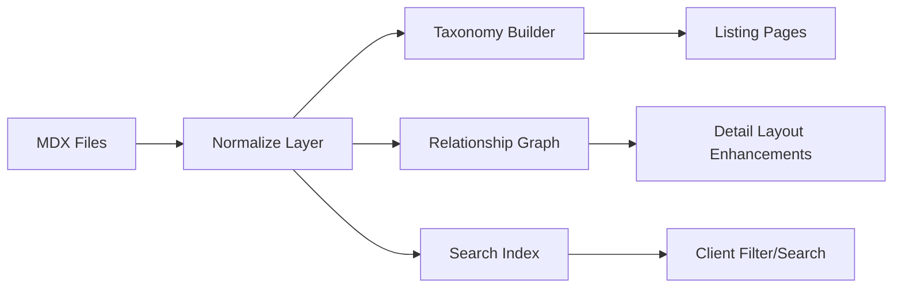

## Architecture Overview (Draft)

This high-level diagram represents the target content pipeline for the upgraded theme.

| Layer | Responsibility |
|-------|---------------|
Normalize Layer | Parse frontmatter, shape unified objects |
Taxonomy Builder | Aggregate tags across sources |
Relationship Graph | Derive reverse links (solutions ↔ industries ↔ posts) |
Search Index | Lightweight offline index for client filtering |
